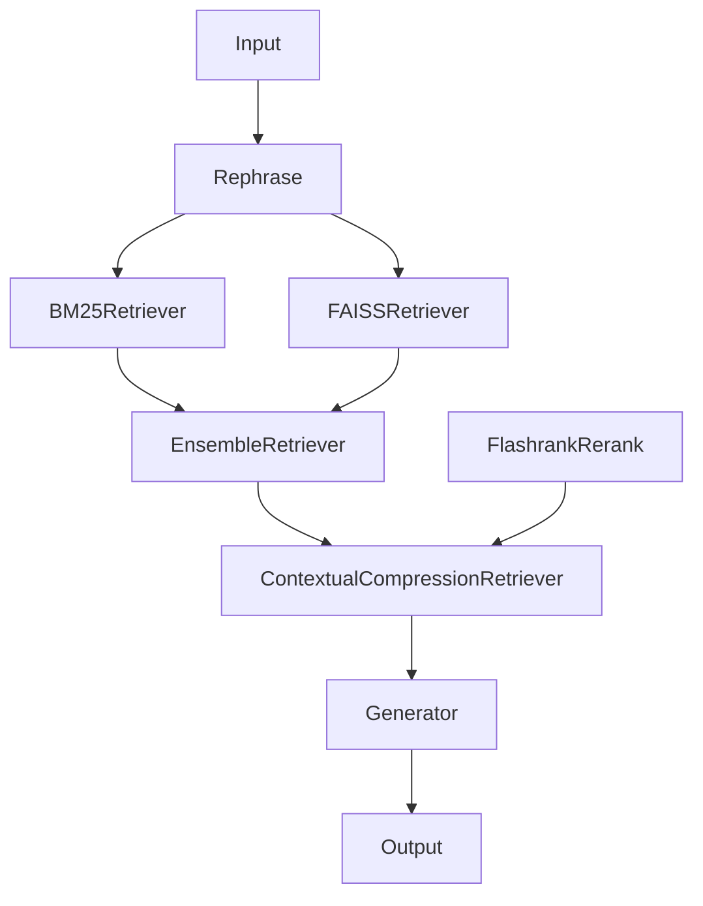

# Кулинарная RAG-система

## Обзор
Этот проект представляет собой систему Retrieval-Augmented Generation (RAG) для кулинарных рецептов. 
Она использует передовые методы обработки естественного языка и информационного поиска для предоставления точных и
контекстно-релевантных предложений рецептов на основе запросов пользователя. Система сочетает гибридный поиск 
с **BM25** и **FAISS**, использует **EnsembleRetriever** для переранжирования и интегрирует **LangGraph**, **GigaChat** и **GigaChatEmbeddings** для надежной обработки запросов и генерации ответов.

## Особенности
- **Гибридный поиск**: Комбинирует разреженный (BM25) и плотный (FAISS) поиск для всестороннего поиска рецептов.
- **Граф-ориентированный процесс**: Применяет LangGraph для оркестрации процессов поиска и генерации.
- **LLM**: Использует GigaChat для создания естественных и контекстно-зависимых ответов.
- **Embeddings**: Использует EmbeddingsGigaR для векторных представлений.
- **Reranking**: Использует EnsembleRetriever для уточнения результатов поиска для повышения релевантности.

## Архитектура

1. **Обработка входного запроса**:
    - **Rephrase**: Запрос пользователя обрабатывается GigaChat с целью перевода на английский язык, формирования утвердительной формы для лучшей работы BM25

2. **Гибридный поиск**:
    - **BM25Retriever**: Выполняет разреженный поиск для определения рецептов на основе соответствия ключевых слов. Для токенизации используется NLTK.
    - **FAISSRetriever**: Проводит поиск, используя семантическое сходство между запросом и эмбеддингами рецептов. Для токенизации используется EmbeddingsGigaR.

3. **Переранжирование**:
    - **EnsembleRetriever**: Комбинирование выходов предыдущих retriever-ов и реранжирует кандидатов рецептов - RRF (Reciprocal Rank Fusion).
    - **ContextualCompressionRetriever -> FlashrankRerank**: реранжирование и фильтрация (SoTA cross-encoders с ms-marco-MultiBERT-L-12).

4. **Генерация ответа**:
    - **GigaChat**: Генерирует ответ на естественном языке, включая детали рецепта, инструкции или персонализированные рекомендации на основе запроса.

## Установка
### Требования
- Python 3.11+
- pip для управления пакетами
- Доступ к API GigaChat (требуется API-ключ)
- Библиотека FAISS

### Настройка
1. Клонируйте репозиторий:
   ```bash
   git clone https://github.com/ikonovalov/rag-education-final.git
   cd rag-education-final
   ```
2. Скачать датасет и построить индексы
    ```bash
   cd scripts
   python download.py && python build_index.py
    ```
4. Запустить main